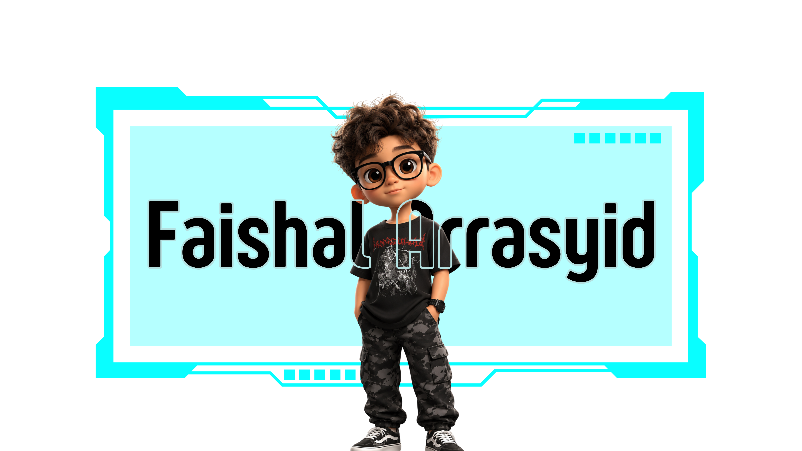

  

<!-- Title -->
<h3 align="center">
    <samp>
        &gt; Hey There!, I am
        <b><a target="_blank" href="https://www.linkedin.com/in/faishal-arrasyid-0bb287345">Faishal Arrasyid</a></b>
    </samp>
</h3>

 

<samp>
「 Software Engineer & Full Stack Developer building awesome projects 」  
</samp>

  

  <picture>
  <source
    media="(prefers-color-scheme: dark)"
    srcset="https://raw.githubusercontent.com/platane/snk/output/github-contribution-grid-snake-dark.svg"
  />
  <source
    media="(prefers-color-scheme: light)"
    srcset="https://raw.githubusercontent.com/platane/snk/output/github-contribution-grid-snake.svg"
  />
  
</picture>

<td width="50%" valign="top">

<h2>🤝 Collaboration</h2>

I’m open to collaborating on:

<ul>
  <li>Open Source Projects</li>
  <li>Web Development</li>
  <li>Full Stack Applications</li>
  <li>AI & Machine Learning</li>
</ul>

</td>

<!-- RIGHT: CONTACT -->
<td width="50%" valign="top" align="center">

<h2>📫 Contact</h2>

 

  

  

  

</td>

</tr>
</table>

⚡ Building awesome projects and always learning new tech

Star ⭐ the repos if they helped you!

  

